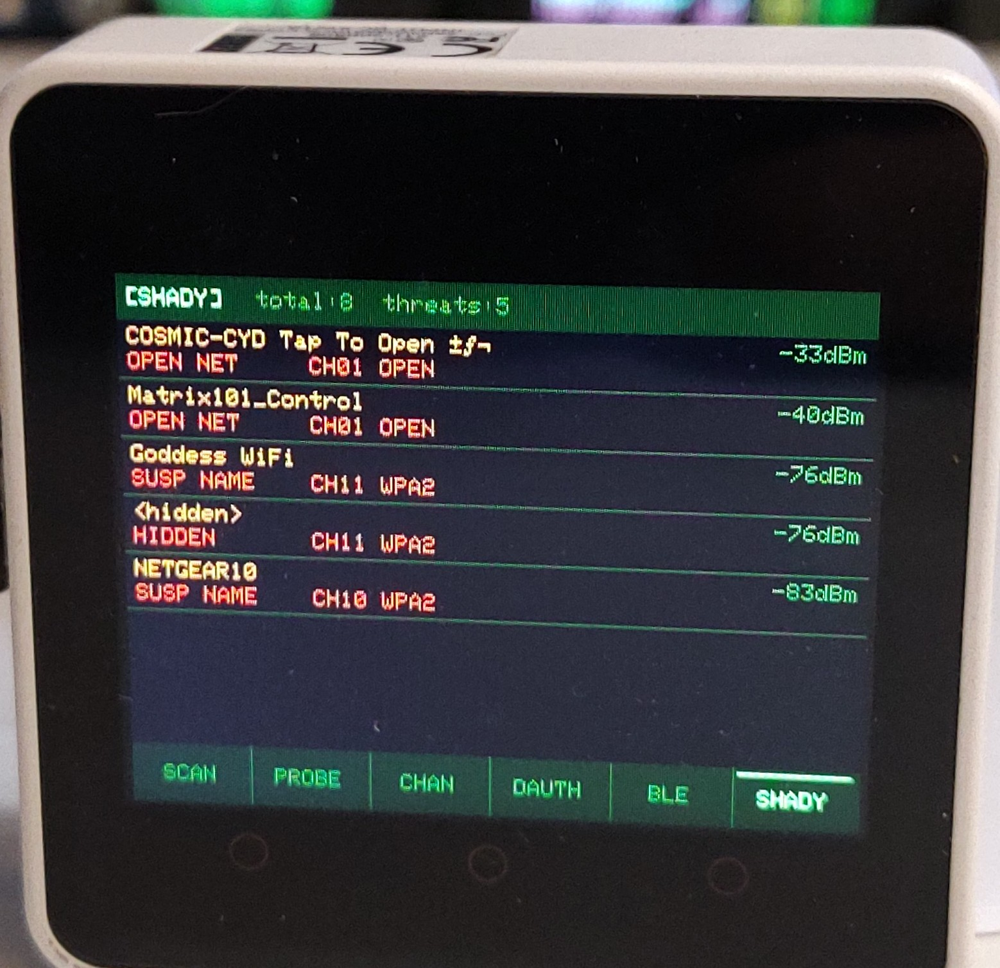
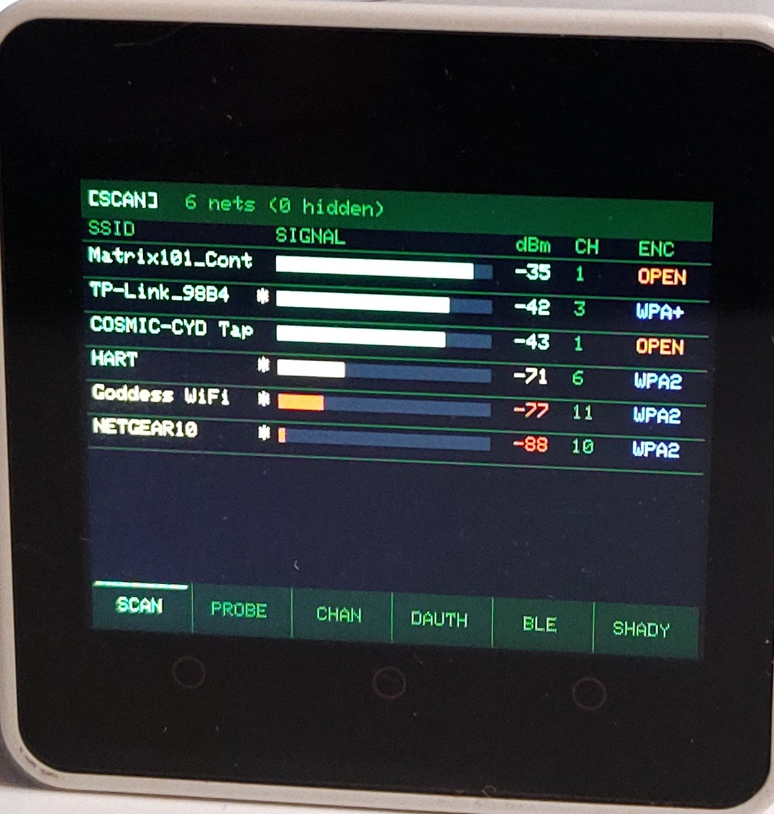

# Core2WiFiScanner

**Advanced WiFi & BLE Security Scanner for M5Stack Core2**

A full-featured wireless security research tool ported from [CYDWiFiScanner](https://github.com) to the M5Stack Core2. Features a green-on-black hacker terminal UI, 6 scanning modes, BLE skimmer detection, threat logging to SD card, and haptic feedback — all on the Core2's 320×240 ILI9341 display.

---

## Photos

| | |
|---|---|
|  |  |

---

## Features

### Scanner Modes

| Mode | Description |
|------|-------------|
| **SCAN** | Active network scanner — sorted SSID list with RSSI signal bars, channel, and encryption type |
| **PROBE** | Probe request sniffer — captures device MACs and the SSIDs they're actively searching for |
| **CHAN** | Channel traffic analyzer — live bar chart of frame density across channels 1–13 |
| **DAUTH** | Deauth / disassoc attack detector — rate-based alerting when your network is under attack |
| **BLE** | BLE skimmer hunter — flags suspicious Bluetooth devices by name patterns and OUI prefix |
| **SHADY** | Suspicious network analyzer — scores nearby networks for evil twin, PineAP, karma attacks, etc. |

### Controls

**Touch footer bar** — tap any mode name to jump directly to it:
```
[ SCAN | PROBE | CHAN | DAUTH | BLE | SHADY ]
```

**Physical buttons:**
| Button | Action |
|--------|--------|
| **Btn A** (left) | Previous mode |
| **Btn B** (middle) | Clear / reset current mode data |
| **Btn C** (right) | Next mode |

### Other Features

- 🟢 Green-on-black hacker terminal theme
- 📳 Haptic vibration feedback on touch events and threat alerts
- 💾 SD card logging — threats written to `/cydscan.txt`
- 📡 BLE scanner runs as a background FreeRTOS task (non-blocking)
- 🔋 Built on M5Core2 library — AXP192 power management, capacitive touch, built-in SD

---

## Hardware

**M5Stack Core2** — [https://shop.m5stack.com/products/m5stack-core2-esp32-iot-development-kit](https://shop.m5stack.com/products/m5stack-core2-esp32-iot-development-kit)

| Spec | Value |
|------|-------|
| MCU | ESP32-D0WDQ6 (dual-core 240MHz) |
| Display | 2.0" ILI9341 320×240 capacitive touch |
| Flash | 16MB |
| RAM | 520KB SRAM + 8MB PSRAM |
| Wireless | WiFi 802.11 b/g/n + Bluetooth 4.2 BLE |
| Storage | microSD (handled by M5.begin) |
| Haptic | Vibration motor via AXP192 LDO3 |

---

## Build & Flash

### Requirements

- [PlatformIO](https://platformio.org/) (VS Code extension or CLI)

### Build

```bash
cd Core2WiFiScanner
pio run
```

### Flash

Connect the Core2 via USB-C, then:

```bash
pio run --target upload
```

Or use the **M5Burner** app with the pre-built merged binary (see below).

### Monitor Serial

```bash
pio device monitor
```

Logs are prefixed: `[SCAN]`, `[PROBE]`, `[CHAN]`, `[DEAUTH]`, `[BLE]`, `[SHADY]`

---

## M5Burner (Pre-built Binary)

A merged `.bin` is included for flashing directly with [M5Burner](https://docs.m5stack.com/en/download) without needing PlatformIO:

```
Core2WiFiScanner_v1.0_MERGED.bin
```

Flash this file to address **0x0** (the file includes bootloader + partition table + firmware in one).

To flash manually with esptool:

```bash
esptool.py --chip esp32 --baud 921600 write_flash 0x0 Core2WiFiScanner_v1.0_MERGED.bin
```

---

## SD Card Logging

Insert a FAT32-formatted microSD card. The scanner automatically logs:

- Detected deauth attacks
- BLE skimmer candidates
- Shady/suspicious networks

Log file: `/cydscan.txt` on the SD card root.

---

## Ported From

This project is a hardware port of **CYDWiFiScanner** (for the ESP32 Cheap Yellow Display / ESP32-2432S028R) to the M5Stack Core2. The WiFi/BLE scanning logic is identical — only the display driver, touch input, and haptic feedback were adapted for the Core2 hardware.

Key changes from CYD to Core2:

| CYD | Core2 |
|-----|-------|
| Arduino_GFX + ILI9341 | M5.Lcd (TFT_eSPI, same API) |
| XPT2046 resistive touch | M5.Touch capacitive touch |
| RGB LED flash | Haptic vibration motor |
| No physical buttons | BtnA / BtnB / BtnC |
| No built-in SD init | M5.begin() handles SD |

---

## Disclaimer

This tool is intended for **educational and authorized security research only**.  
Only use it on networks and devices you own or have explicit permission to test.  
Unauthorized network scanning or interception may be illegal in your jurisdiction.

---

## License

MIT License — do whatever you want, stay ethical.
